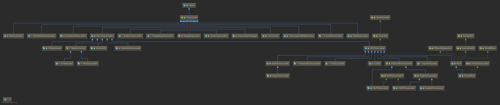

#类加载-加载
## 类加载器
### 类加载器继承实现关系


类加载器体系结构
| 概念 | 说明 |
| :--- | :--- |
| BootstrapClassLoader |  |  
| ExtClassLoader |  |
| AppClassLoader |  |
| 自定义类加载器 |  |

```Java
public abstract class ClassLoader { 
    
    private final ClassLoader parent;
    
    private ClassLoader(Void unused, ClassLoader parent) {
        this.parent = parent;
        if (ParallelLoaders.isRegistered(this.getClass())) {
            parallelLockMap = new ConcurrentHashMap<>();
            package2certs = new ConcurrentHashMap<>();
            domains =
                Collections.synchronizedSet(new HashSet<ProtectionDomain>());
            assertionLock = new Object();
        } else {
            // no finer-grained lock; lock on the classloader instance
            parallelLockMap = null;
            package2certs = new Hashtable<>();
            domains = new HashSet<>();
            assertionLock = this;
        }
    }
    
    protected Class<?> loadClass(String name, boolean resolve)
        throws ClassNotFoundException
    {
        synchronized (getClassLoadingLock(name)) {
            // First, check if the class has already been loaded
            Class<?> c = findLoadedClass(name);
            if (c == null) {
                long t0 = System.nanoTime();
                try {
                    if (parent != null) {
                        c = parent.loadClass(name, false);
                    } else {
                        c = findBootstrapClassOrNull(name);
                    }
                } catch (ClassNotFoundException e) {
                    // ClassNotFoundException thrown if class not found
                    // from the non-null parent class loader
                }

                if (c == null) {
                    // If still not found, then invoke findClass in order
                    // to find the class.
                    long t1 = System.nanoTime();
                    c = findClass(name);

                    // this is the defining class loader; record the stats
                    sun.misc.PerfCounter.getParentDelegationTime().addTime(t1 - t0);
                    sun.misc.PerfCounter.getFindClassTime().addElapsedTimeFrom(t1);
                    sun.misc.PerfCounter.getFindClasses().increment();
                }
            }
            if (resolve) {
                resolveClass(c);
            }
            return c;
        }
    }
    
    public URL getResource(String name) {
        URL url;
        if (parent != null) {
            url = parent.getResource(name);
        } else {
            url = getBootstrapResource(name);
        }
        if (url == null) {
            url = findResource(name);
        }
        return url;
    }
    
    public Enumeration<URL> getResources(String name) throws IOException {
        @SuppressWarnings("unchecked")
        Enumeration<URL>[] tmp = (Enumeration<URL>[]) new Enumeration<?>[2];
        if (parent != null) {
            tmp[0] = parent.getResources(name);
        } else {
            tmp[0] = getBootstrapResources(name);
        }
        tmp[1] = findResources(name);

        return new CompoundEnumeration<>(tmp);
    }
    
    @CallerSensitive
    public final ClassLoader getParent() {
        if (parent == null)
            return null;
        SecurityManager sm = System.getSecurityManager();
        if (sm != null) {
            // Check access to the parent class loader
            // If the caller's class loader is same as this class loader,
            // permission check is performed.
            checkClassLoaderPermission(parent, Reflection.getCallerClass());
        }
        return parent;
    }
    
    boolean isAncestor(ClassLoader cl) {
        ClassLoader acl = this;
        do {
            acl = acl.parent;
            if (cl == acl) {
                return true;
            }
        } while (acl != null);
        return false;
    }
    
    protected Package getPackage(String name) {
        Package pkg;
        synchronized (packages) {
            pkg = packages.get(name);
        }
        if (pkg == null) {
            if (parent != null) {
                pkg = parent.getPackage(name);
            } else {
                pkg = Package.getSystemPackage(name);
            }
            if (pkg != null) {
                synchronized (packages) {
                    Package pkg2 = packages.get(name);
                    if (pkg2 == null) {
                        packages.put(name, pkg);
                    } else {
                        pkg = pkg2;
                    }
                }
            }
        }
        return pkg;
    }
    
    protected Package[] getPackages() {
        Map<String, Package> map;
        synchronized (packages) {
            map = new HashMap<>(packages);
        }
        Package[] pkgs;
        if (parent != null) {
            pkgs = parent.getPackages();
        } else {
            pkgs = Package.getSystemPackages();
        }
        if (pkgs != null) {
            for (int i = 0; i < pkgs.length; i++) {
                String pkgName = pkgs[i].getName();
                if (map.get(pkgName) == null) {
                    map.put(pkgName, pkgs[i]);
                }
            }
        }
        return map.values().toArray(new Package[map.size()]);
    }
}
```