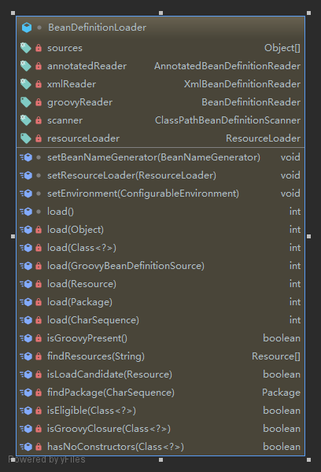

# spring bean
## Resource 


Resource接口主要作用是提供InputStream,URL,URI,File类型的资源,简而言之就是获取资源（不同方式）  


ResourceLoader接口主要作用一个获取资源的统一方法

## Bean  


BeanDefinition接口主要是定义bean的属性，不同的实现提供了个性化的属性  

BeanDefinitionLoader主要是通过设置ResourceLoader，加载解析Resource
## spring boot 创建bean过程
spring 启动 入口 是下面这句  
```Java
    public static void main(String[] args) {
        SpringApplication.run(DueDiligenceApplication.class, args);
    }
```
分析其调用过程，定位到下面这个方法，忽视无关这次分析的代码
```Java
	/**
	 * Run the Spring application, creating and refreshing a new
	 * {@link ApplicationContext}.
	 * @param args the application arguments (usually passed from a Java main method)
	 * @return a running {@link ApplicationContext}
	 */
	public ConfigurableApplicationContext run(String... args) {
        //other code
		try {
			//other code
			context = createApplicationContext();
            //other code
			prepareContext(context, environment, listeners, applicationArguments, printedBanner);
			refreshContext(context);
			afterRefresh(context, applicationArguments);
			//other code
		}
		//other code
		return context;
	}
```
prepareContext:其调用逻辑
```Java
	private void prepareContext(ConfigurableApplicationContext context, ConfigurableEnvironment environment,
			SpringApplicationRunListeners listeners, ApplicationArguments applicationArguments, Banner printedBanner) {
		context.setEnvironment(environment);
		postProcessApplicationContext(context);
		applyInitializers(context);
		listeners.contextPrepared(context);
		if (this.logStartupInfo) {
			logStartupInfo(context.getParent() == null);
			logStartupProfileInfo(context);
		}
		// Add boot specific singleton beans
		ConfigurableListableBeanFactory beanFactory = context.getBeanFactory();
		beanFactory.registerSingleton("springApplicationArguments", applicationArguments);
		if (printedBanner != null) {
			beanFactory.registerSingleton("springBootBanner", printedBanner);
		}
		if (beanFactory instanceof DefaultListableBeanFactory) {
			((DefaultListableBeanFactory) beanFactory)
					.setAllowBeanDefinitionOverriding(this.allowBeanDefinitionOverriding);
		}
		if (this.lazyInitialization) {
			context.addBeanFactoryPostProcessor(new LazyInitializationBeanFactoryPostProcessor());
		}
		// Load the sources
		Set<Object> sources = getAllSources();
		Assert.notEmpty(sources, "Sources must not be empty");
		load(context, sources.toArray(new Object[0]));
		listeners.contextLoaded(context);
	}
```

